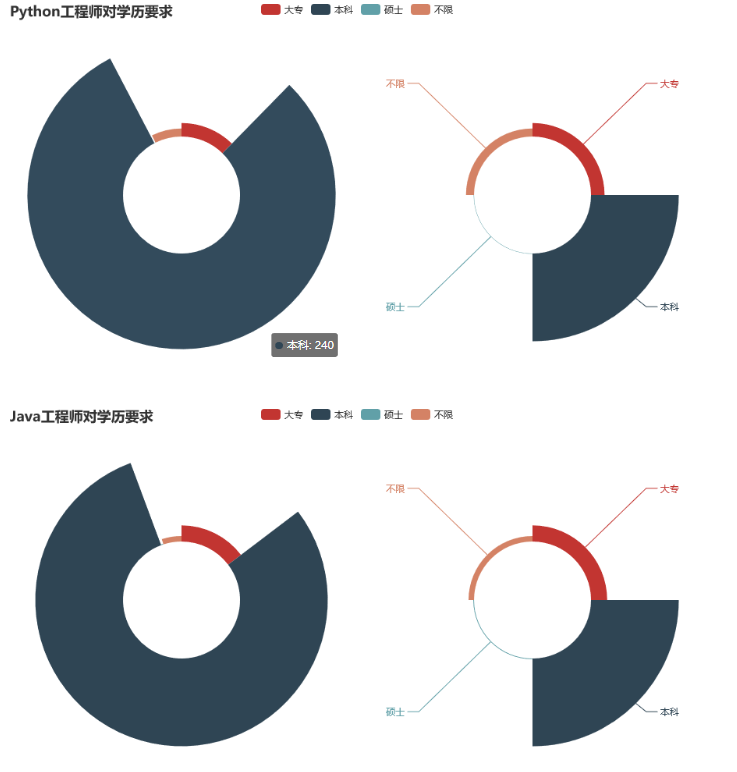

# 拉勾网Java工程师和Python工程的招聘信息分析

## 数据采集

先说说数据采集过程中遇到的问题，首先请求头是一定要伪装的，否则第一步就会给你弹出**你的请求太频繁，请稍后再试**，其次网站具有多重反爬策略，我在一篇微信公众号中看到了解决方案：就是每次先获取session然后更新我们的session进行抓取，增加自更新机制，最后就可以拿到了想要的数据。

Chrome浏览器右键检查查看**network**，找到链接`https://www.lagou.com/jobs/positionAjax.json?needAddtionalResult=false` 

而且在分析了报文之后 可以观察到请求是以`post`的方式传递的，同时传递了参数

```java
datas = {
            'first': 'false',
            'pn': x,
            'kd': 'python',
        }
```

同时不难发现每次点击下一页都会同时发送一条`get`请求,经过探索，发现这个`get`请求和我们`post`请求是一致的.

so，就开始快乐的爬数据吧！

最后，我爬了40页602条数据，分别存放到了excel文件中（只是粗浅的做一下分析）


## 数据清洗

就是进行了一下简单的清洗操作

1.删除空值 （dropna函数）

2.填充空值（fillna函数）

3.删除重复值 （drop_duplicates()函数)

4.格式内容清洗（薪资：#k-#k）

##  数据可视化

> 我们这里采用一种自己刚接触的很好用的库：pyecharts
>
> 在anaconda里边的 prompt直接 pip install pyecharts 就可以下载到 （这里我自己亲测需要python3.6以上）

pyecharts里边有好多好看的，好用的包：

- Bar（柱状图/条形图） 
- Bar3D（3D 柱状图） 
- Boxplot（箱形图） 
- EffectScatter（带有涟漪特效动画的散点图） 
- Funnel（漏斗图） 
- Gauge（仪表盘） 
- Geo（地理坐标系） 
- Graph（关系图） 
- HeatMap（热力图） 
- Kline（K线图） 
- Line（折线/面积图） 
- Line3D（3D 折线图） 
- Liquid（水球图） 
- Map（地图） 
- Parallel（平行坐标系） 
- Pie（饼图） 
- Polar（极坐标系） 
- Radar（雷达图） 
- Sankey（桑基图） 
- Scatter（散点图） 
- Scatter3D（3D 散点图） 
- ThemeRiver（主题河流图） 
- WordCloud（词云图）

我分别对岗位在全国的分布，对学历水平的要求以及薪资做了简单的分析：(我都生成了html，大家也可以直接生成图)





## 简单分析

1.依据数据来看，Python工程师在全国提供的岗位要比Java要少很多 而且基本上集中在了北深。

2.岗位对学历的要求，因为数据较少，没有什么太大的区别，但是Python工程对本科生的友好程度其实远不及Java工程师，而且要求的工作经验也是更加丰富些。

3.给予的薪资的话Python工程师在高薪资就业行业里边还是充满着前景，Java工程师给予的薪资变化相对平缓，但是Python工程师给予的薪资在某一个程度上有爆发式的增长。所以Python工程师可以很明显的区分高级，中级，初级的水准。

总结：（摘自一个微信公众号对此的分析）就业寒冬来临，我们需要的是理性客观的看待，而不是盲目地悲观或乐观。如果爱好Python，仍旧可以入坑，不过要注意一个标签有工作经验，就算没有工作经验，自己在学习Python的过程中一定要尝试独立去做一个完整的项目，爬虫也好，数据分析也好，亦或者是开发，都要尝试独立去做一套系统，在这个过程中培养自己思考和解决问题的能力。持续不断的学习，才是对自己未来最好的投资，也是度过寒冬最正确的姿势。Java开发一直也是本科生就业的一个不二之选，入门简单，但是深度学习之后也会倍感吃力，不管选择什么岗位，因为职业的要求，IT行业知识的迭代之快，需要我们更加努力地去加油！！！


